# RegiTrust
### Blockchain Based Land Registry App

RegiTrust is designed to streamline the process of land registry using blockchain technology. By leveraging blockchain's properties such as immutability and transparency, the project aims to create a secure and efficient system for recording land ownership and transactions. This not only simplifies the process of accessing land records but also helps in reducing crimes such as scams, bribes, and illegal encroachments.

## Table of Contents

1. [Introduction](#introduction)
2. [Features](#features)
3. [Installation](#installation)
4. [Usage](#usage)
5. [Technologies Used](#technologies-used)
6. [Contributing](#contributing)
7. [License](#license)

## Introduction

The primary purpose of the Blockchain Land Registry App is to provide a digital platform for managing land registry records efficiently. By utilizing blockchain technology, the project ensures the integrity and transparency of land ownership records, making it easier to access and verify property information.

## Features

- Cross-platform functionality using [Dart](https://dart.dev/) and [Flutter](https://flutter.dev/).
- Compatibility with the [Polygon](https://polygon.technology/) blockchain network.
- Functionality to showcase land area on a map using [Mapbox API](https://www.mapbox.com/).
- Local testing capability using [Ganache](https://www.trufflesuite.com/ganache).
- Utilization of blockchain characteristics such as immutability and transparency.
- Transfer of ownership requiring authentication from both parties.
- Generation of a receipt upon successful land transfer.

## Installation (Polygon)

To install the project, follow these steps:
1. Clone the repository to your local machine.
2. Ensure that Flutter and Dart are installed on your system.
3. Install truffle via npm `npm install -g truffle`.
4. Setup [Alchemy](https://www.alchemy.com/) and project in Polygon Amoy network.
5. Refer to Amoy api and documentation on alchemy and make changes to `truffle-config.js` and other source file accordingly.
6. Run:
```
truffle init
truffle compile
truffle migrate --reset
```
7. Copy the contract address as shown below and paste in contract address variavle in `lib\constant\constants.dart`
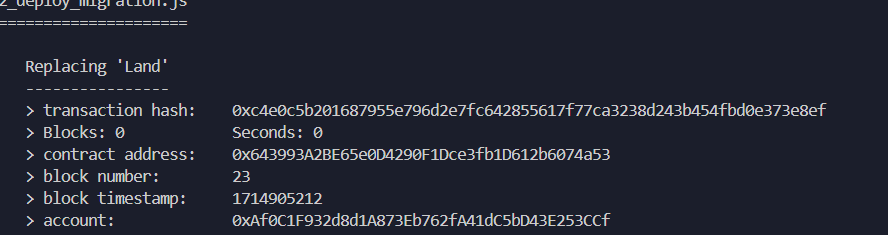

8. Install any dependencies using `flutter pub get`.
9. Run the project using ` flutter run -d web-server --web-port 5555`
10. Ensure that Metamask is connect to the same network as the Application and add the required wallets.
11. If need of funds for gas head to https://www.alchemy.com/faucets/polygon-amoy 
1. Run the web interface on `http://localhost:6000`


## Installation (Non Polygon)

To install the project, follow these steps:
1. Clone the repository to your local machine.
2. Ensure that Flutter and Dart are installed on your system.
3. Install truffle via npm `npm install -g truffle`.
4. Install and Start [Ganache](https://archive.trufflesuite.com/ganache/)
5. Run:
```
truffle init
truffle compile
truffle migrate --reset
```
6. Copy the contract address as shown below and paste in contract address variavle in `lib\constant\constants.dart`


7. Install any dependencies using `flutter pub get`.
8. Run the project using ` flutter run -d web-server --web-port 5555`
9. Ensure that Metamask is connect to the same network as the Application and add the required wallets.
10. Run the web interface on `http://localhost:6000`


## Usage

The usage of the Blockchain Land Registry App involves the following steps:
1. Users create their accounts and get verified by land inspectors.
2. Users add land details, including area, price, address, and documents.
3. Land inspectors verify the land details.
4. Users can choose to sell their land, and buyers can send buy requests.
5. The transfer of ownership requires authentication from both parties and generates a receipt.

## Technologies Used

The project utilizes the following technologies, frameworks, and APIs:
- [Dart](https://dart.dev/) and [Flutter](https://flutter.dev/) for cross-platform development.
- [ImageBB API](https://imagebb.com/) for document uploading.
- API for Ethereum to INR conversion.
- [Mapbox API](https://www.mapbox.com/) for capturing map coordinate data.
- Solidity for smart contracts.
- Truffle for connecting smart contracts with the network.
- Ganache as a local development network.
- Polygon AMOY network for testing and development.

## Contributing

Contributions to the project are welcome! To contribute:
1. Clone the repository.
2. Ensure that the project is running successfully on your machine.
3. Make your desired changes.
4. Submit a pull request referencing this README.

## License

This project is licensed under the MIT License. See the [LICENSE](LICENSE) file for details.

## Project Flowchart
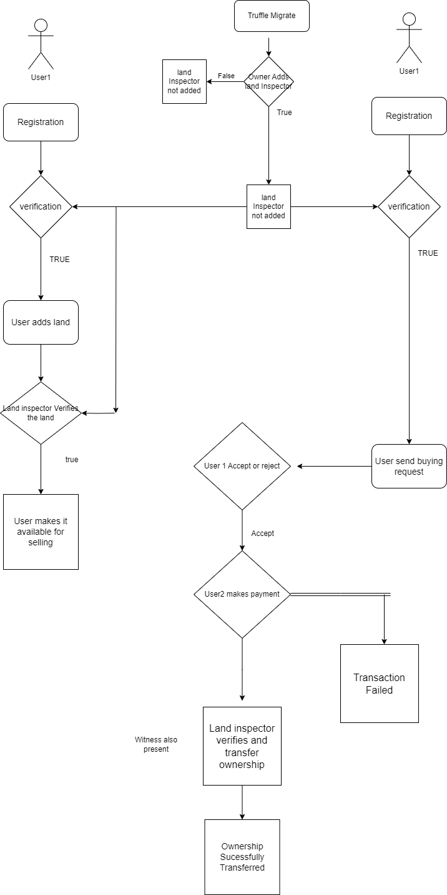

## Screenshots
  Polygon Amoy Project      |          Home Page     
  :---------------------------------:        |      :------------------------------:
   | 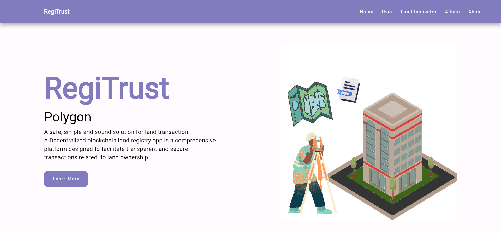

  Wallet connect/Login      |         Contract Owner Dashboard  
:---------------------------------:        |      :------------------------------:
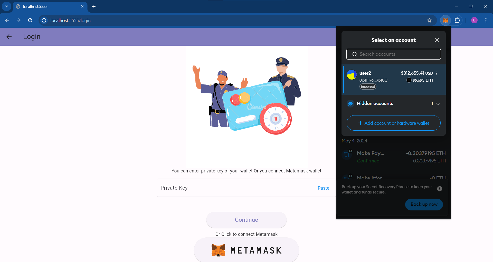|        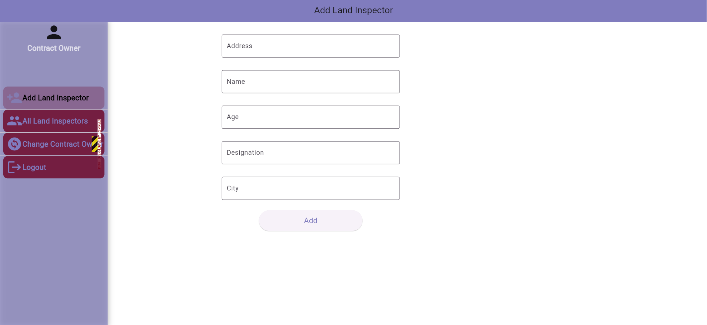

Land Inspector Dashboard                   |            User Registration      
:---------------------------------:        |      :------------------------------:
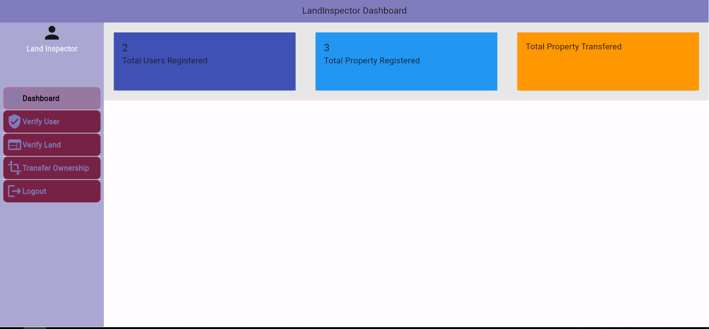     |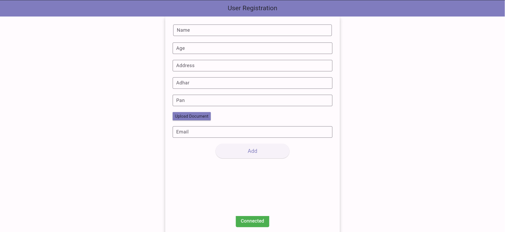

User Dashboard               |                      User Verification 
:---------------------------------:        |      :------------------------------:
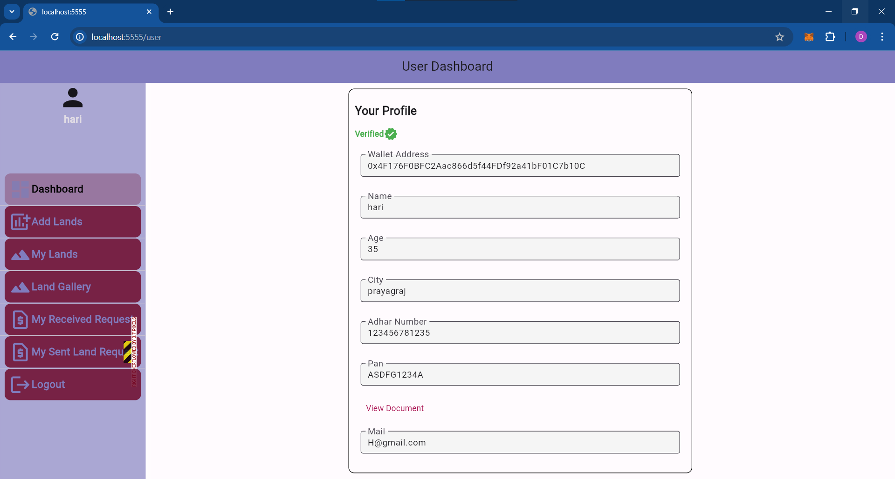     |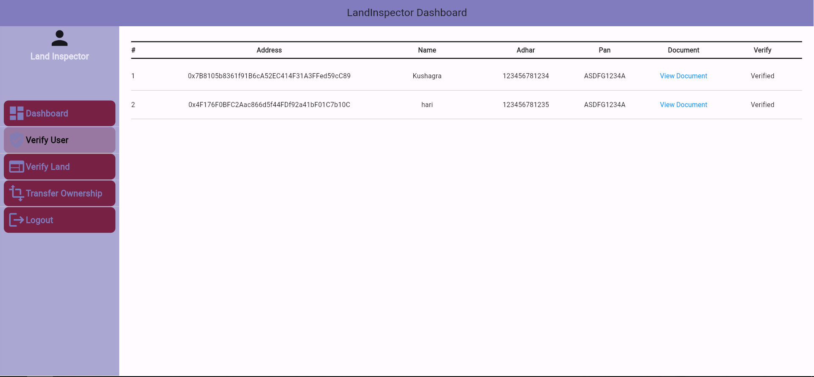

Adding land on Map             |                   Land Details    
:---------------------------------:        |      :------------------------------:
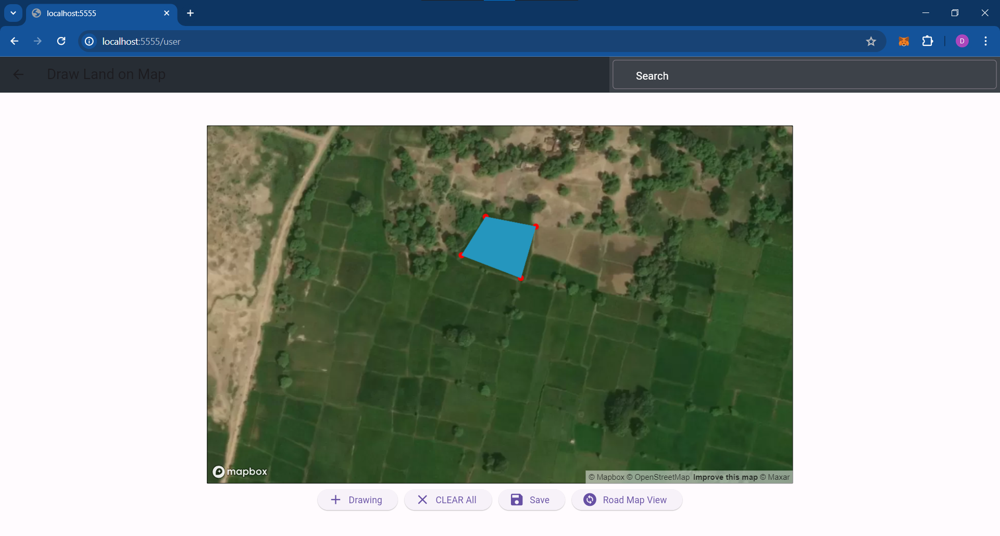     |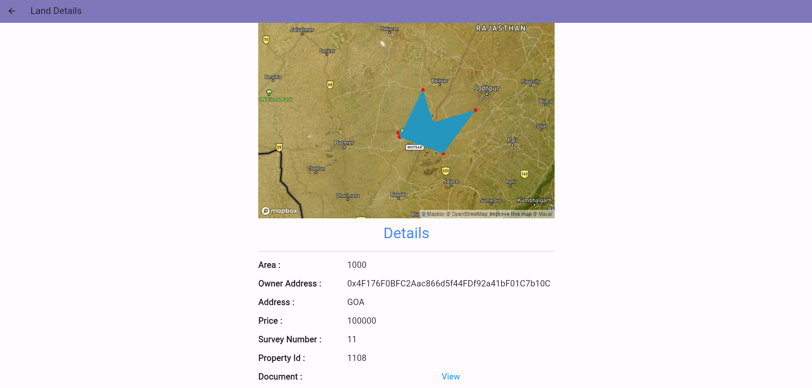

Land Verification        |                   Payment  
:---------------------------------:        |      :------------------------------:
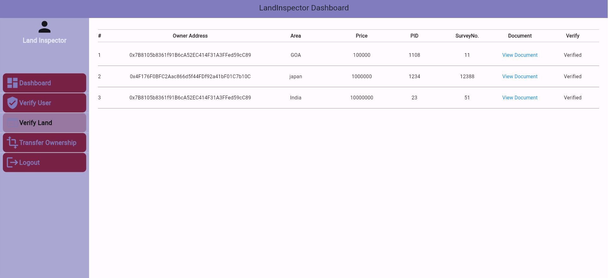     |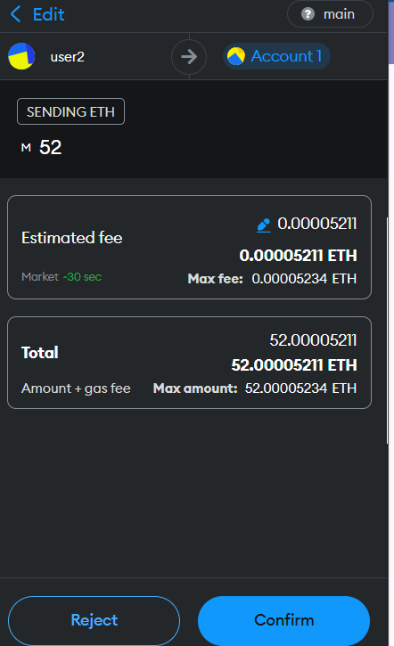

Transfer ownership  |                Witness
:---------------------------------:        |      :------------------------------:
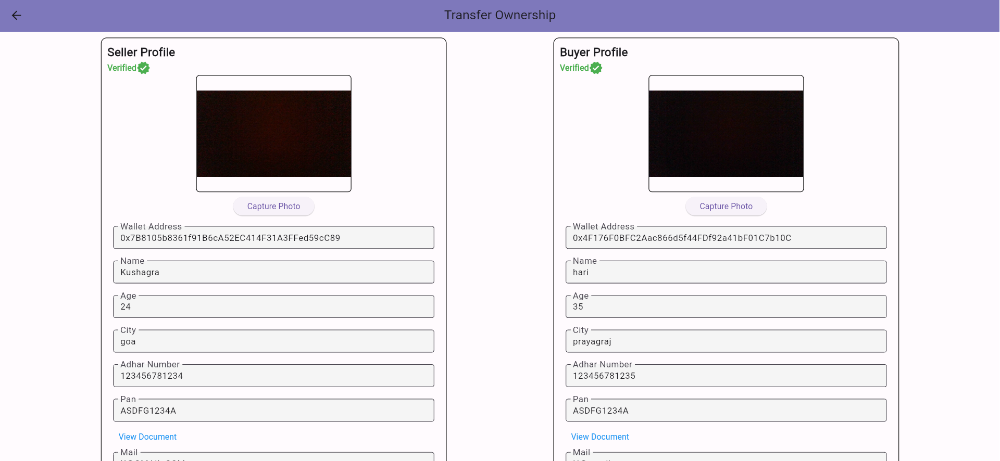     |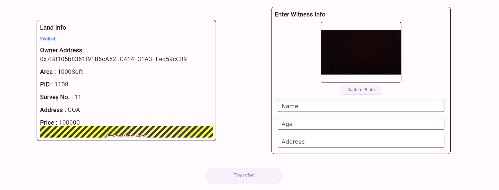

Generated Document  |
:---------------------------------:        |
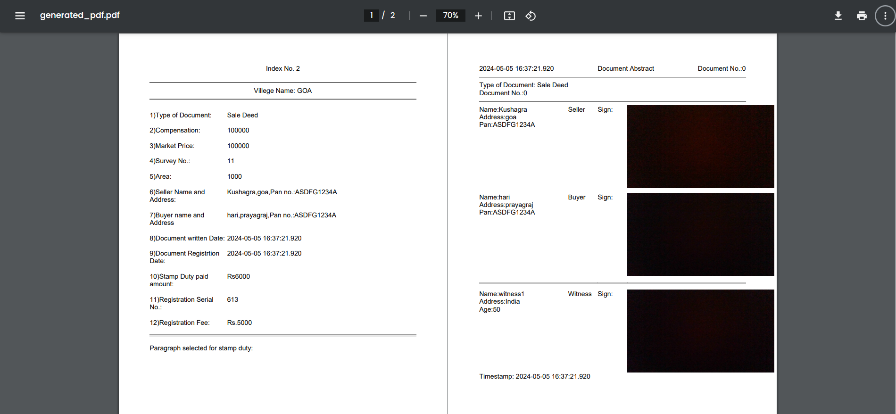     |

Note: Document Images are blacked out for privacy reasons.
